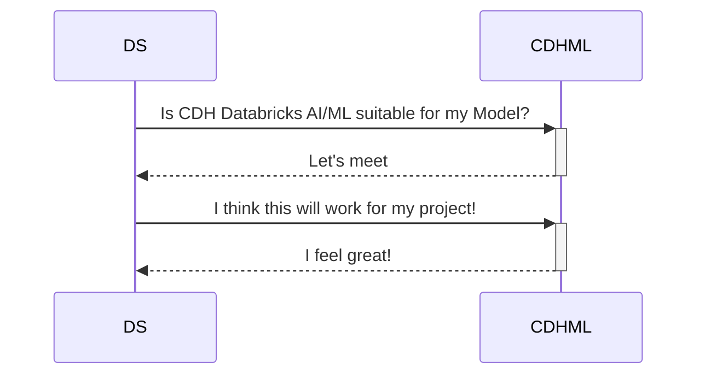
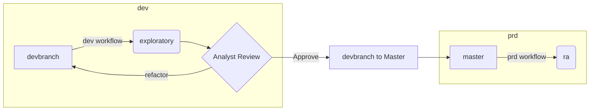

#### Engagement for Advanced Methods

```mermaid
sequenceDiagram
    DS->>+CDHML: Is CDH Databricks AI/ML suitable for my Model?
    CDHML-->>-DS: Let's meet
    DS->>+CDHML: I think this will work for my project!
    CDHML-->>-DS: I feel great!
```
#### CI/CD for Advanced Methods

```mermaid
flowchart LR
    subgraph dev
        A[devbranch] -->|dev workflow| B(exploratory)
        B --> C{Analyst Review}
        C -->|refactor| A
    end
    C -->|Approve| Gp
        Gp[devbranch to Master] --> Ap[master] 
    subgraph prd
        Ap-->|prd workflow| Bp(ra)
    end

```
