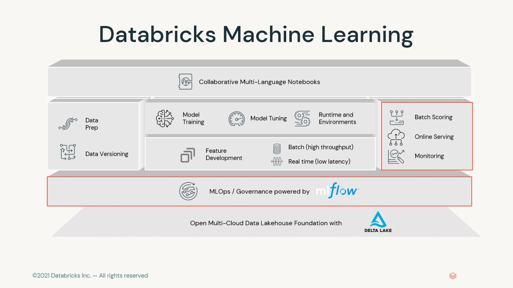
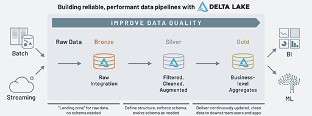
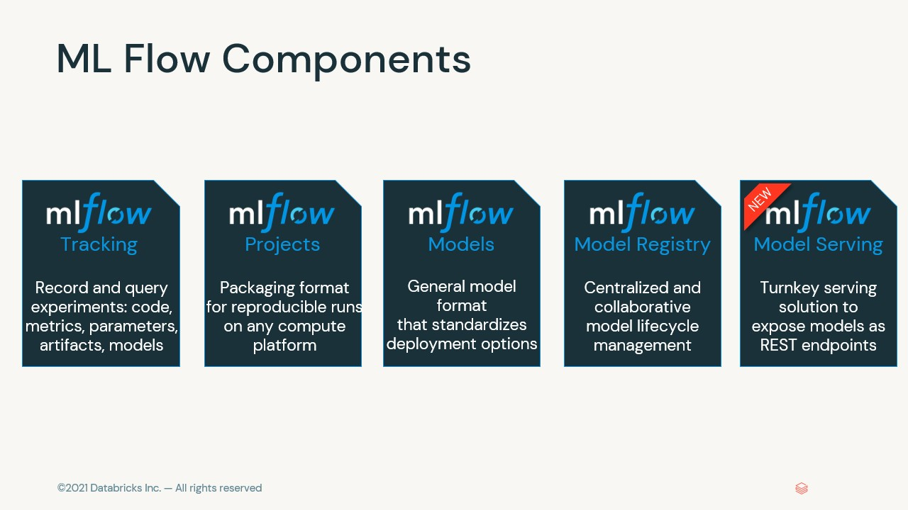
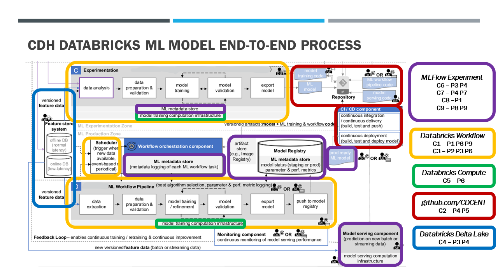
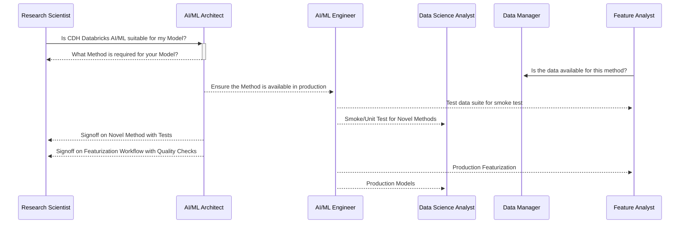
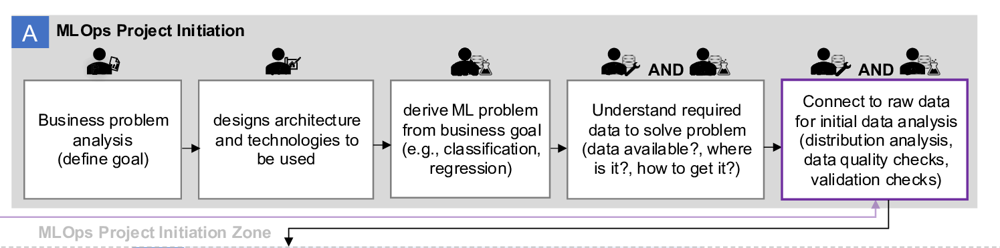
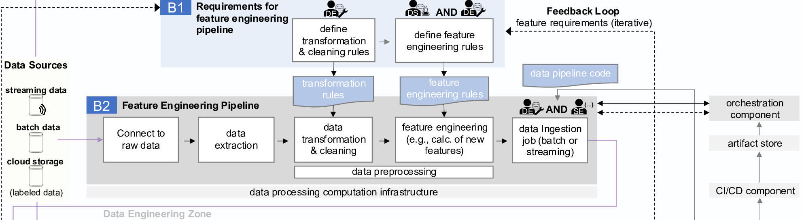
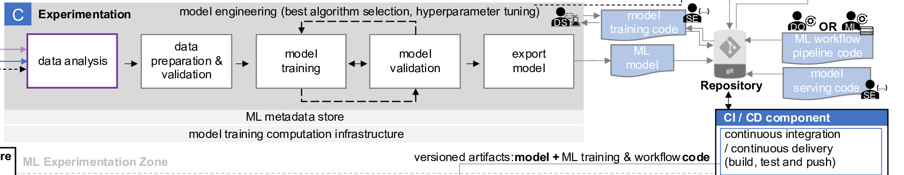
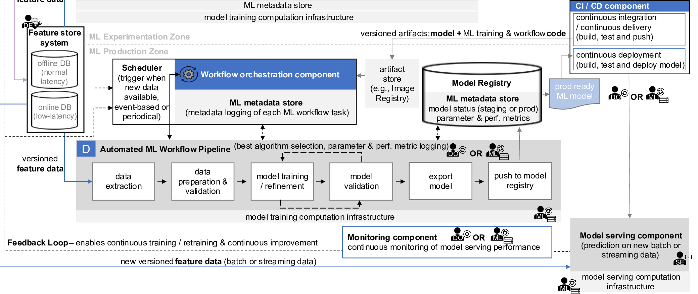
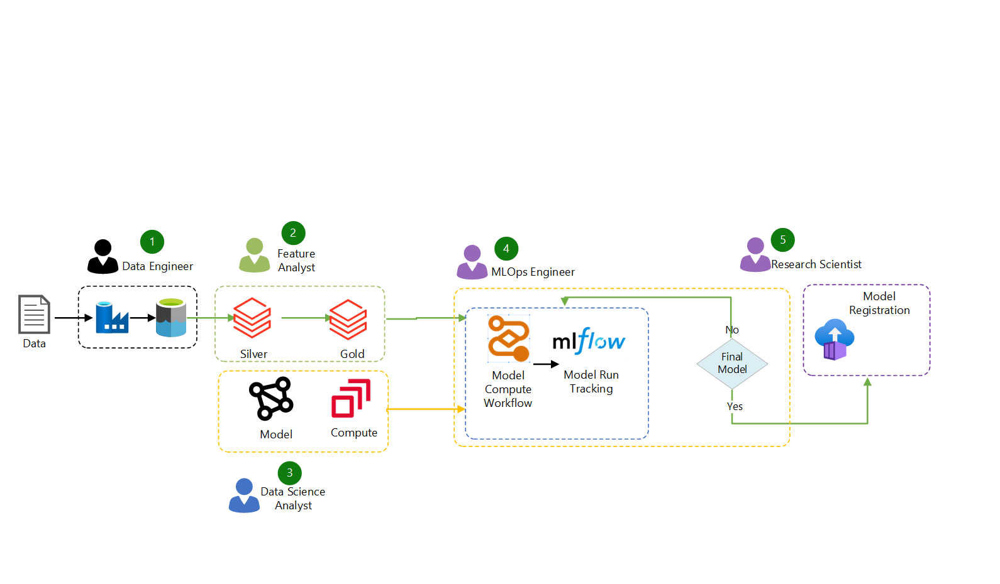

# cdh-mlops
Configurations, tools and tested methods for CDC Data Hub MLOps

### [MLOps workflow on Azure Databricks - Azure Databricks | Microsoft Learn](https://learn.microsoft.com/en-us/azure/databricks/machine-learning/mlops/mlops-workflow "Databricks Workflow")
<!---
What is MLOps?
--------------

MLOps is a set of processes and automated steps to manage code, data, and models, combining DevOps, DataOps, and ModelOps.

ML assets such as code, data, and models are developed in stages that progress from early development stages that do not have tight access limitations and are not rigorously tested, through an intermediate testing stage, to a final production stage that is tightly controlled. The Databricks Lakehouse platform lets you manage these assets on a single platform with unified access control. You can develop data applications and ML applications on the same platform, reducing the risks and delays associated with moving data around.

--->
# [MLOps](## "MLOps is a set of processes and automated steps to manage code, data, and models, combining DevOps, DataOps, and ModelOps.ML assets such as code, data, and models are developed in stages that progress from early development stages that do not have tight access limitations and are not rigorously tested, through an intermediate testing stage, to a final production stage that is tightly controlled. The Databricks Lakehouse platform lets you manage these assets on a single platform with unified access control. You can develop data applications and ML applications on the same platform, reducing the risks and delays associated with moving data around.") Best Practices -- Principles and Components

<---
[In the context of MLOps](https://arxiv.org/ftp/arxiv/papers/2205/2205.02302.pdf), a **principle** is a guide to how things should be realized in MLOps and is closely related to the term “best practices” from the professional sector. The identified nine principles required to realize MLOps are:
--->
## [MLOps Best Practices -- Nine Principles](https://arxiv.org/ftp/arxiv/papers/2205/2205.02302.pdf "A **principle** is a guide to how things should be realized in MLOps and is closely related to the term “best practices” from the professional sector") 
* `P1` [**CI/CD (Continuous Integration/Continuous Development)**](## "CI/CD Automation provides continuous integration, continuous delivery, and continuous deployment. It carries out the build, test, delivery, and deploy steps. It provides fast feedback to developers regarding the success or failure of certain steps, thus increasing the overall productivity")
  
* `P2` [**Workflow Orchestration**](## "Workflow Orchestration coordinates the tasks of an ML workflow pipeline according to directed acyclic graphs (DAGs). DAGs define the task execution order by considering relationships and dependencies") 
* `P3` [**Reproducibility**](## "Reproducibility is the ability to reproduce an ML experiment and obtain the exact same results")
* `P4` [**Versioning of Data, Code, and Model**](## "Versioning enables not only reproducibility, but also traceability (for compliance and auditing reasons)")
* `P5` [**Collaboration**](## "Collaboration ensures the possibility to work collaboratively on data, model, and code. Besides the technical aspect, this principle emphasizes a collaborative and communicative work culture aiming to reduce domain silos between different roles")
* `P6` [**Continuous ML Training and Evaluation**](## "Continuous training means periodic retraining of the ML model based on new feature data. Continuous training is enabled through the support of a monitoring component, a feedback loop, and an automated ML workflow pipeline. Continuous training always includes an evaluation run to assess the change in model quality")
* `P7` [**ML Metadata tracking for each orchestrated ML workflow task**](## "Metadata tracking and logging is required for each training job iteration (e.g., training date and time, duration, etc.), including the model specific metadata—e.g., used parameters and the resulting performance metrics, model lineage: data and code used—to ensure the full traceability of experiment runs")
* `P8` [**Continuous Monitoring**](## "The periodic assessment of data, model, code, infrastructure resources, and model serving performance (e.g., prediction accuracy) to detect potential errors or changes that influence the product quality")
* `P9` [**Feedback Loops**](## "Integrate insights from the quality assessment step into the development or engineering process (e.g., a feedback loop from the experimental model engineering stage to the previous feature engineering stage). Another feedback loop is required from the monitoring component (e.g., observing the model serving performance) to the scheduler to enable the retraining")

## MLOps Components

* `C1` **ML CI/CD** (**P1**, **P6**, **P9**) -- Model Databricks Job Workflows DAG tasks (P6) integrated with Github CDCENT/cdh-ml repos (P1,P9) and MLFLow Experiments 
* `C2` **Source Code Repository** (**P4**,**P5**) -- Shared CDH repos across projects - GitHub Configurations,  GitHub branches
* `C3` **Workflow Orchestration Component** (**P2**, **P3**, **P6**) -- Databricks Job Workflows (P6,P2) integrated with MLFlow Experiments (P3)
* `C4` **Feature Store System (**P3**,**P4**)** -- CDH Delta Lake
* `C5` **Model Training Infrastructure (**P6**)** -- EDAV Azure Databricks Compute and components
* `C6` **Model Registry** - Databricks MLFLow Experiment
* `C7` **ML Metadata Stores** - Databricks MLFLow Experiment Runs
* `C8` **Model Serving** - Azure Databricks MLflow Model Serving
* `C9` **Model Monitoring** -- MLFlow Experiment, CDH Delta Lake, Databricks Job Workflows

<!---
An execution environment is the place where models and data are created or consumed by code. Each execution environment consists of clusters, their runtimes and libraries, and automated workflows.
#### Feature Repos **P1** **P3** **P5** **P4** **P9**

The core Feature Repo is [cdh-ml-featurestore](https://www.github.com/cdcent/cdh-ml-featurestore) which has base subdirectories by **Enriched** Zone data source, beginning with [abfm](https://www.github.com/cdcent/cdh-ml-featurestore/abfm) and [premier](https://www.github.com/cdcent/cdh-ml-featurestore/premier) for source specific transforms and decodes from **Enriched** to **Exploratory** Zone, as well as a [shared](https://www.github.com/cdcent/cdh-ml-featurestore/shared) directory for code.

The output of the featurization processes are [Databricks Workflow](https://www.github.com/cdh-ml-featurestore/workflows) "task" code from **Enriched** to **Exploratory** Zone with validation reports and the associated workflow definitions. Each **Enriched** Zone CDH dataset should have at least one **Exploratory** transform to a core format used in the feature development step. The code is owned and maintained by Data Science Analysts with assistance from MLOPs, and during the Dev phase is tested on a defined subset of the base data. Initial use cases are times series person data with codes.

The output of the the feature definition process is python code to either build feature primitives from lookup keys or other feature primitives. Lookup keys are validated against *Reference Data*.

The Feature Analyst defined validation reports, promotes code from Dev to Validation, and approves promotion to Production for full Featurization runs for the components of the featurization process.

#### Model Repos **P1** **P3** **P5** **P4** **P9** 

The core Model Repo is [cdh-ml-models](https://www.github.com/cdcend/cdh-ml-models). This repo has base directories by broad model category, beginning with `unstructured` and `timeseries`, and a `shared` directory with common code to support both methods and MLOps. A `workflows` base folder contains the model workflow json files, which are defined by the Data Science Analyst and the ML Engineer, and link the model code to compute within a DAG with parameterization and intertask communication, one for each repo branch.

The `Dev` branches will be project based rather than shared, but the `production` branch follows the same patterns as Feature repos, with the Data Science Analyst promoting from *Dev* through a validation process to `production`. 

### Access control and versioning **P2** **P6** **P7** 

Access control and versioning are key components of any software operations process. 

*   **Manage models and model development with MLflow.** `Experiments` will track thethe model development process using [MLflow](https://learn.microsoft.com/en-us/azure/databricks/mlflow/) to track and save code snapshots, model parameters, metrics, and other metadata. Use the [Model Registry](https://learn.microsoft.com/en-us/azure/databricks/mlflow/model-registry) to manage model versioning and deployment status. The Model Registry handles [access control for models](https://learn.microsoft.com/en-us/azure/databricks/security/auth-authz/access-control/workspace-acl#configure-mlflow-model-permissions).

### Deploy code, not models **P1** **P5**

During the ML development process, we promote _code_, rather than _models_, from one environment to the next. Moving project assets this way ensures that all code in the ML development process goes through the same code review and integration testing processes. It also ensures that the production version of the model is trained on production code. For a more detailed discussion of the options and trade-offs, see [Model deployment patterns](https://learn.microsoft.com/en-us/azure/databricks/machine-learning/mlops/deployment-patterns).
-->

## MLOps Roles

This architecture is described both in terms of the principles implemented the roles of the participants for CDH Data Lake Architecure on Azure Databricks.

*   **Principal Investigator/Research Scientist** : Owner of Production Model Experiment; defines the business
goal to be achieved with ML and takes care of the communication
side of the business, e.g., presenting the return on investment (ROI)
generated with an ML product; Oversees runs with Data Scientist and ML Engineer defining parameters and hyperparameters, artifacts, exhibits. Registers Experiment Runs as Models for deployment, defines which Production Models are refreshed based on feature store or method changes and which Production Models are archived.

The business stakeholder 

*   **ML Architect**:  designs the architecture and defines the technologies to be used, following a thorough evaluation; responsible for performing various tasks on the data in the target storage layer, to prepare it for model prediction. 

*   **Data Science Analyst**:  Working with the (`R5`) **ML Engineer**,  translates the scientific problem into an ML problem ~and takes care of the model engineering, including the selection of the best-performing algorithm and hyperparameters.~ For CDH Databricks Machine Learning, this role defines methods with appropriate covariates for a Modelling project; Provides Test Cases for Dev evaluation of methods prior to inclusion in a project;  validates that the chosen methods are correctly matched to  the method tasks for the  *WorkFlow*. Validates preliminary model results on validation Feature Store appropriate for initial validation and CI/CD. 

With the **Principal Investigator**, may be responsible for building a prediction model based on Featurization Delta Tables created by **Feature Analyst**. 

*  **CDH Data Manager** is responsible for orchestrating production [`*Databricks Jobs Workflows*](./workflows) for Featurization (data pipelines) from CDH **enhanced** or **curated** zones. The expected output are delta or feature tables stored in the CDH Data Lake **ML** Zone.  

*   **Feature Analyst**: ~Working with **Data Manager**, responsible defining ,creating or validating ~~*Feature Store* or~~ *Featurization Delta Tables*, with the **Data Science Analyst** responsible for ensuring validation scripts that the chosen methods are correctly matched to the Featurization Assets and the **MODEL** method *WorkFlow*
The tasks include transforming, cleansing, data standardization, and feature engineering.
  ~~* Cleansing: Pre-process the data, removing null values, dropping unneeded columns, and code validation against reference tables~~ **CDH**
  * Transforming: Collect transactional data into a form suitable for analysis
       * times series: star schema with events as facts and feature primitive codes as dimensions
       * unstructured date: person_id/note_datetime/note_id in keeping with OMOP CDM NOTES, plus unstructured field
  * Data Standarization: Standardize column names across **Enriched** Zone data sets, following the [OMOP CDM](https://github.com/cdcent/cdh-ml-featurestore/tree/master/timeseries)-like naming conventions whenever possible
  * Feature Engineering: Define core feature primitives based on codings, and compound feature primitives as necessary from those cores
  * Validation on core dataset: ensure basic statistics or metrics on the core feature primitives
  * Model CDH *CDH_{data}_ra*: Cohort and Covariate feature stores appropriate for the method

*  **MLOps Engineer**/**ML Engineer**/**DevOps Engineer** bridges the gap between development and operations and ensures proper CI/CD automation, ML workflow orchestration, model deployment to production, and monitoring.This cross-domain role builds up and operates the ML infrastructure, manages the automated ML workflow pipelines and model deployment to production, and monitors both the deployed model and the ML infrastructure. For CDH Databricks ML, this role is responsible for creating and maintaining the model [*WorkFlow*](./workflows) and [*Compute*](./compute) configurations in requirements.txt a/k/a Library Configurations or Python Environments for models through CI/CD from Dev, to Validation and into Production with the code the **Data Science Analyst** provides The expected output is models that are ready for production, reproducible, and can be easily refactored for changes in *Compute* configuration, covering `DevOps` Engineer for MVP, V1, and V2. 

## Architecture and Workflow

On the basis of the identified principles, components, and roles, we derive a generalized MLOps end-to-end architecture to give ML researchers and practitioners proper guidance. It is depicted in Figure 4. Additionally, we depict the workflows, i.e., the sequence in which the different tasks are executed in the different stages. The artifact was designed to be technology-agnostic. Therefore, ML researchers and practitioners can choose the best-fitting technologies and frameworks for their needs.  
As depicted in Figure 4, we illustrate an end-to-end process, from MLOps project initiation to the model serving. It includes:    

### CDH ML Project Initiation 

  1. The Principal Investigator/Research Scientist (R1) analyzes the business and identifies a potential
problem that can be solved using ML.  
  2. The AI/ML Architect (R2) defines the architecture design for the overall ML system and, decides on the technologies to be used after a thorough evaluation.  
  3. The Data Scientist (R3) derives an ML problem—such as whether regression or classification should be used—from the business goal. 
  4. The Data Engineer (R4) and the data scientist (R3) work together in an effort to understand which data is required to solve the problem e.g. which CDC Data Hub source data, demographics, time series, unstructured, or other data.
  5.  Once the answers are clarified, the data engineer (R4) and data scientist (R3) determine if the silver medallion featurization tables are sufficient to provide the data needs of the project.  ~~collaborate to locate the raw data sources for the initial data analysis. They check the distribution, and quality of the data, as well as performing validation checks.~~  ~~Furthermore, they ensure that the incoming data from the data sources is labeled, meaning that a target attribute is known, as this is a mandatory requirement for supervised ML.~~ In this example, the data sources already had labeled data available as the labeling step was covered during an upstream process.

### CDH ML Featurization Process

#### Requirements for __feature engineering pipeline__
The features are the relevant attributes required for model training.
After ~~the initial understanding of the raw data and~~ the initial data
analysis, the fundamental requirements for the feature engineering
pipelines are defined, as follows: 

6. The data engineer (R4) defines any data transformation rules (normalization, aggregations) and ~~cleaning~~ normalization rules to bring the silver tables.
7. The data scientist (R3) and data engineer (R4) together define the feature engineering rules, such as the calculation of new and more advanced features based on other features. These initially defined rules must be iteratively adjusted by the data scientist (R3) either based on the feedback coming from the experimental model engineering stage or from the monitoring component observing the
model performance.  

#### B2 Feature engineering pipeline. 
The initially defined requirements for the feature engineering pipeline are taken by the data engineer (R4) and software engineer (R5) as a starting point to build up the prototype of the feature engineering pipeline. The
initially defined requirements and rules are updated according to
the iterative feedback coming either from the experimental model
engineering stage or from the monitoring component observing the
model’s performance in production. As a foundational requirement,
the data engineer (R4) defines the code required for the CI/CD (C1)
and orchestration component (C3) to ensure the task orchestration
of the feature engineering pipeline. This role also defines the
underlying infrastructure resource configuration. 
8.  First, the feature engineering pipeline connects to the *silver medallion layer* in CDC Data Hub Cloud storage  ~~raw data, which can be
(for instance) streaming data, static batch data, or data from any
cloud storage.~~ 
~~9. The data will be extracted from the data sources.
10.  The data preprocessing begins with data transformation and
cleaning tasks. The transformation rule artifact defined in the
requirement gathering stage serves as input for this task, and the
main aim of this task is to bring the data into a usable format. These
transformation rules are continuously improved based on the
feedback.~~
~~11. The feature engineering task calculates new and more
advanced features based on other features. The predefined feature
engineering rules serve as input for this task. These feature
engineering rules are continuously improved based on the feedback.
13. Lastly, a data ingestion job loads batch or streaming data into
the feature store system (C4). The target can either be the offline or
online database (or any kind of data store).~~
### CDH ML Experimental/Developmental Model

Most tasks in the experimentation stage
are led by the data scientist (R3). The data scientist is supported by
the software engineer (R5). 
13. The data scientist (R3) connects to
the feature store system (C4) for the data analysis. (Alternatively,
the data scientist (R3) can also connect to the raw data for an initial
analysis.) In case of any required data adjustments, the data
scientist (R3) reports the required changes back to the data
engineering zone (feedback loop).
14. Then the preparation and validation of the data coming
from the feature store system is required. This task also includes
the train and test split dataset creation. 
15. The data scientist (R3)
estimates the best-performing algorithm and hyperparameters, and
the model training is then triggered with the training data (C5). The
software engineer (R5) supports the data scientist (R3) in the
creation of well-engineered model training code. 16. Different
model parameters are tested and validated interactively during
several rounds of model training. Once the performance metrics
indicate good results, the iterative training stops. The bestperforming
model parameters are identified via parameter tuning.
The model training task and model validation task are then
iteratively repeated; together, these tasks can be called “model
engineering.” The model engineering aims to identify the bestperforming
algorithm and hyperparameters for the model. 
17. The
data scientist (R3) exports the model and commits the code to the
repository.
As a foundational requirement, either the DevOps engineer (R6)
or the ML engineer (R7) defines the code for the (C2) automated
ML workflow pipeline and commits it to the repository. Once either
the data scientist (R3) commits a new ML model or the DevOps
engineer (R6) and the ML engineer (R7) commits new ML
workflow pipeline code to the repository, the CI/CD component
(C1) detects the updated code and triggers automatically the CI/CD
pipeline carrying out the build, test, and delivery steps. The build
step creates artifacts containing the ML model and tasks of the ML
workflow pipeline. The test step validates the ML model and ML
workflow pipeline code. The delivery step pushes the versioned
artifact(s)—such as images—to the artifact store (e.g., image
registry).
### CDH ML Production Model 

The DevOps engineer
(R6) and the ML engineer (R7) take care of the management of the
automated ML workflow pipeline. They also manage the
underlying model training infrastructure in the form of hardware
resources and frameworks supporting computation such as
Kubernetes (C5). The workflow orchestration component (C3)
orchestrates the tasks of the automated ML workflow pipeline. For
each task, the required artifacts (e.g., images) are pulled from the
artifact store (e.g., image registry). Each task can be executed via
an isolated environment (e.g., containers). Finally, the workflow
orchestration component (C3) gathers metadata for each task in the
form of logs, completion time, and so on.
Once the automated ML workflow pipeline is triggered, each of
the following tasks is managed automatically: 18. automated
pulling of the versioned features from the feature store systems
(data extraction). Depending on the use case, features are extracted
from either the offline or online database (or any kind of data store).
19. Automated data preparation and validation; in addition, the
train and test split is defined automatically. 20. Automated final
model training on new unseen data (versioned features). The
algorithm and hyperparameters are already predefined based on the
settings of the previous experimentation stage. The model is
retrained and refined. 
21. Automated model evaluation and iterative adjustments of hyperparameters are executed, if required.
Once the performance metrics indicate good results, the automated
iterative training stops. The automated model training task and the
automated model validation task can be iteratively repeated until a
good result has been achieved. 
22. The trained model is then
exported and 
23. pushed to the model registry (C6), where it is
stored e.g., as code or containerized together with its associated
configuration and environment files.
For all training job iterations, the ML metadata store (C7)
records metadata such as parameters to train the model and the
resulting performance metrics. This also includes the tracking and
logging of the training job ID, training date and time, duration, and
sources of artifacts. Additionally, the model specific metadata
called “model lineage” combining the lineage of data and code is
tracked for each newly registered model. This includes the source
and version of the feature data and model training code used to train
the model. Also, the model version and status (e.g., staging or
production-ready) is recorded.
Once the status of a well-performing model is switched from
staging to production, it is automatically handed over to the
DevOps engineer or ML engineer for model deployment. From
there, the  
24. CI/CD component (C1) triggers the continuous
deployment pipeline. The production-ready ML model and the
model serving code are pulled (initially prepared by the software
engineer (R5)). The continuous deployment pipeline carries out the
build and test step of the ML model and serving code and deploys
the model for production serving. The (25) model serving
component (C8) makes predictions on new, unseen data coming
from the feature store system (C4). This component can be
designed by the software engineer (R5) as online inference for realtime
predictions or as batch inference for predictions concerning
large volumes of input data. For real-time predictions, features
must come from the online database (low latency), whereas for
batch predictions, features can be served from the offline database
(normal latency). Model-serving applications are often configured
within a container and prediction requests are handled via a REST
API. As a foundational requirement, the ML engineer (R7)
manages the model-serving computation infrastructure. The (26)
monitoring component (C9) observes continuously the modelserving
performance and infrastructure in real-time. Once a certain
threshold is reached, such as detection of low prediction accuracy,
the information is forwarded via the feedback loop. The (27)
feedback loop is connected to the monitoring component (C9) and
ensures fast and direct feedback allowing for more robust and
improved predictions. It enables continuous training, retraining,
and improvement. With the support of the feedback loop,
information is transferred from the model monitoring component
to several upstream receiver points, such as the experimental stage,
data engineering zone, and the scheduler (trigger). The feedback to
the experimental stage is taken forward by the data scientist for
further model improvements. The feedback to the data engineering
zone allows for the adjustment of the features prepared for the
feature store system. Additionally, the detection of concept drifts
as a feedback mechanism can enable (28) continuous training. For
instance, once the model-monitoring component (C9) detects a drift in the data [3], the information is forwarded to the scheduler, which
then triggers the automated ML workflow pipeline for retraining
(continuous training). A change in adequacy of the deployed model
can be detected using distribution comparisons to identify drift.
Retraining is not only triggered automatically when a statistical
threshold is reached; it can also be triggered when new feature data
is available, or it can be scheduled periodically.

### MLOps paradigm
### 

Dev stage
---------
The focus of the development stage is experimentation. Data Science Analysts develop featurization data, feature definitions, and explore methods.  

**** Insert **Curated** Feature process here ****

The output of the method development phase are cluster definitions and test cases for methods not available in the Databricks ML Clusters. The cluster definitions should include requirements.txt for libraries, list of support files, environment variables, and spark configurations. Method tests should include workflow tasks including data with tests to validate methods.

Validation stage
-----------------
The focus of the validation stage is integration. At this stage, a new method is validated against existing feature stores, or a new feature store is validated with a known method, within a workflow and validation Experiment for tracking. 

This stage also ensures the integration and performance of the workflow tasks, passing of unit and integration tests, and validation reports for approval by Data Science Analyst.

The validation stage is repeated whenever a method is updated, or new data is added to a feature store, _even if no development code changes have occured_

Upon approval of ML Engineer and validation by Data Science Analyst, the code can be promoted to Production.

Production stage
----------------
MLOps Service Accounts *own* both the development and production environment, where ML Workflows a/k/a ML pipelines are deployed. These pipelines compute fresh feature values, train and test new model versions, publish predictions to downstream tables or applications, and monitor the entire process to avoid performance degradation and instability.

Data Science Analysts typically do not have write or compute access in the production environment. However, it is important that they have visibility to test results, logs, model artifacts, and production pipeline status, to allow them to identify and diagnose problems in production.

### Insert MLOps production stage pipeline HERE

The numbered steps correspond to the numbers shown in the diagram.

### Update feature tables

As new production data becomes available, this pipeline ingests it and updates the production feature store tables. This pipeline can be run as a batch or streaming job and can be scheduled, triggered, or run continuously.

### Run model

Create a new run of the production version of the model on the full production data and optionally register it with the MLflow Model Registry. This pipeline can be triggered by code changes or by automated retraining jobs.

This pipeline includes 2 tasks:

*   **Training and tuning.** As in the development stage, autologging saves a record of the training process to the MLflow tracking server. This includes model metrics, parameters, tags, and the model itself.
    
    During development, Data Science Analysts may test many algorithms and hyperparameters. In the production training code, it’s common to consider only the top-performing options. Limiting tuning in this way saves time and can reduce the variance from tuning in automated retraining.
    
    All model training should register the model artifacts in the [MLflow Model Registry](https://learn.microsoft.com/en-us/azure/databricks/mlflow/model-registry) for the production environment. The initial Model Registry stage is “None”.

*   **Evaluation.** Model quality is evaluated by testing on held-out production data. The results of these tests are logged to the MLflow tracking server. This step uses the evaluation metrics specified by Data Science Analysts in the development stage. These metrics may include custom code

[Machine Learning Architecture](https://learn.microsoft.com/en-us/azure/architecture/example-scenario/ai/predict-hospital-readmissions-machine-learning#workflow)
--------

Post-Production
--------------

### Online serving (REST APIs) <----NOT IN ORIGINAL PLAN

For low-latency use cases, you can use MLflow to deploy the model for online serving. Options include Databricks Model Serving, cloud provider serving endpoints, or custom serving applications.

The serving system loads the Production model version from the Model Registry. For each request, it fetches features from an online Feature Store, scores the data, and returns predictions. You can log requests and predictions using the serving system, the data transport layer, or the model.

### Inference: batch or streaming

For batch or streaming inference jobs, the pipeline reads the latest data from the Feature Store, loads the Production model version from the Model Registry, scores the data, and returns predictions. Batch or streaming inference is generally the most cost-effective option for higher throughput, higher latency use cases.

Batch jobs typically publish predictions to Lakehouse tables, over a JDBC connection, or to flat files. Streaming jobs typically publish predictions to Lakehouse tables or to message queues like Apache Kafka.

###  Monitoring **P8** **P9**

*   If new data is available on a regular basis, you can create a [scheduled job](https://learn.microsoft.com/en-us/azure/databricks/workflows/jobs/create-run-jobs) to run the model training code on the latest available data.
*   If the monitoring pipeline can identify model performance issues and send alerts, you can configure it to automatically trigger retraining. Automatic retraining and redeployment can improve model performance with minimal human intervention if the pipeline can detect situations such as a change in the distribution of incoming data or a degradation in model performance.
