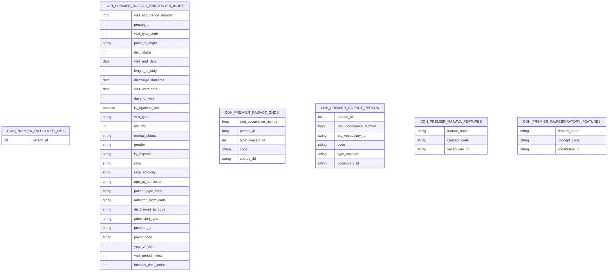

```mermaid
erDiagram
   CDH_PREMIER_RA.COHORT_LIST {
     int     person_id
}
   CDH_PREMIER_RA.FACT_ENCOUNTER_INDEX {
     long    visit_occurrence_number
     int     person_id
     int     visit_type_code
     string  point_of_origin
     int     disc_status
     date    visit_end_date
     int     length_of_stay
     date    discharge_datetime
     date    visit_start_date
     int     days_of_visit
     boolean is_inpatient_visit
     string  visit_type
     int     ms_drg
     string  marital_status
     string  gender
     string  is_hispanic
     string  race
     string  race_ethnicity
     string  age_at_admission
     string  patient_type_code
     string  admitted_from_code
     string  discharged_to_code
     string  admission_type
     string  provider_id
     string  payor_code
     int     year_of_birth
     int     visit_period_index
     int     hospital_time_index
}
   CDH_PREMIER_RA.FACT_OHDSI {
     long    visit_occurrence_number
     long    person_id
     int     type_concept_id
     string  code
     string  source_tbl
}
   CDH_PREMIER_RA.FACT_PERSON {
     int     person_id
     long    visit_occurrence_number
     string  src_vocabulary_id
     string  code
     string  type_concept
     string  vocabulary_id
}
   CDH_PREMIER_RA.LAVA_FEATURES {
     string  feature_name
     string  concept_code
     string  vocabulary_id
}
   CDH_PREMIER_RA.RESPIRATORY_FEATURES {
     string  feature_name
     string  concept_code
     string  vocabulary_id
}
```
