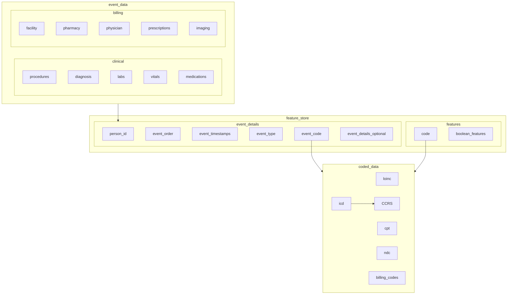

### Featurization for EHR data

```mermaid
flowchart TD
 subgraph clinical
    procedures
    diagnosis
    labs
    vitals
    medications
 end
 subgraph billing
    facility
    pharmacy
    physician
    prescriptions
    imaging
 end
 subgraph event_data
    clinical
    billing
 end
 subgraph coded_data
    loinc
    icd-->CCRS
    cpt
    ndc
    billing_codes
 end
 subgraph event_details
    person_id
    event_order
    event_timestamps
    event_type
    event_code
    event_details_optional
 end
 subgraph features
   code
   boolean_features
 end
 subgraph feature_store
  event_details
  features
 end

 event_data --> event_details
 event_code-->coded_data
 code-->coded_data
```

