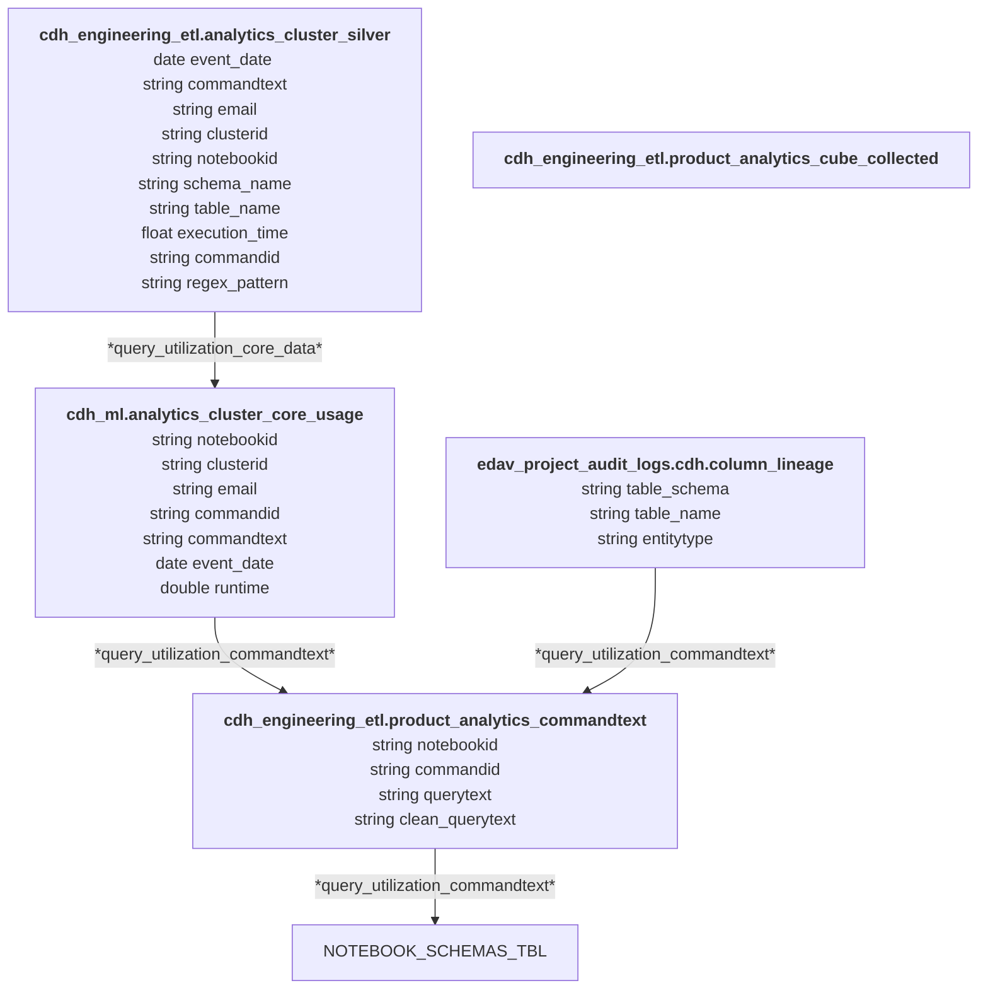

### Product Analytics - Table Utilization

*   Query and user counts by table, dataset, and database
		- What we need to answer here
			- Number of users for a time range that queried the table (repeat for database)
			- Number of queries for a time range that for a table (repeat for database)
*	Costs by query and usage
      - total execution time for a command id/text for a time range

command text
		- tables
		- databases

Logical Data Model for product analytics given the silver table
 
Dims

user (email, rest for later)
notebook (notebookid, rest for later)
cluster (clusterid, rest for later)
commands (commandid, commandtext, notebookid)
 
FACT - Core Silver table
**user** 
	notebookid
		commandid			
			executiontime

FACT		
database
	table
		column (future)
		#of users
		#of notebooks

### Source Data Assets 
* ~~information_schema.tables~~~
* edav_project_audit_logs.cdh.column_lineage

#### Primary Data Assets **cdh_engineering_etl**
* analytics_cluster_silver - daily snapshot of notebooks with commandtext,commandid,execution_time,email,cluster_id
  
#### Analytics Data Assets **cdh_engineering_etl**
* analytics_cluster_cube_collected - usage by core values
* analytics_cluster_cube - core_usage commandtext mapped to schemas as the core BI "cube" data for further analytics
* analytics_cluster_core_usage - daily aggregation of all silver tables by notebookid, commandid
* ~~~analytics_cluster_schemas - daily extract of cdh_* table info (excluding cdh_premier) ~~~

### Entity Relationship Diagrams

