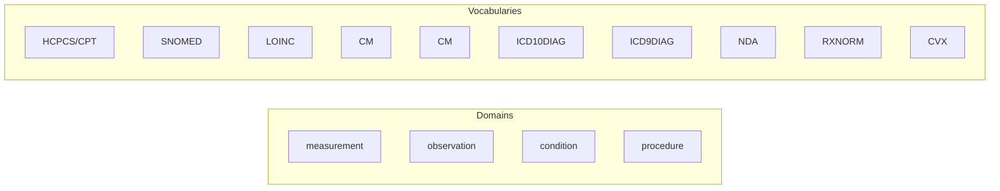
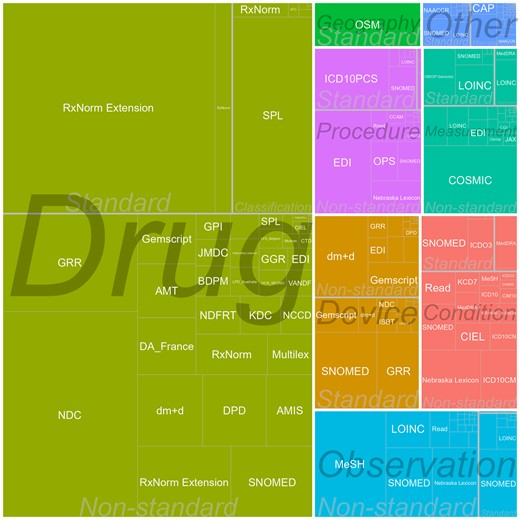

###  Data Hub Silver Medallion Layer to support Advanced Analytics

Designed to be a complement and/or source for OHDSI OMOP CDM systems from DataHub EHR data sources, relying on the [OHDSI Standardized Vocabularies](https://academic.oup.com/jamia/article/31/3/583/7510741) as the Reference Ontology.

#### core codebase
[*/concept_set*](./concept_set) code for concept concept_set () maintenance and review  
[*/facts*](./facts) code for fact time series data  
[*/note*](./note) code for NOTE data  
[*/geospatial*](./geospatial) code for geospatial data  
[*/reference*](./reference) code for reference data, e.g. Vocbulary support, concept cross reference  
#### support code
[*/utilities*](./utilities) shared code snippets and procs -- to be migrated to CDH library  
[*/examples*](./examples) example code from external sources  
[*/workflows*](./workflows) active workflows jobs json or yaml  
[*/docs*](./docs) documentation  
[*/obsolete*](./obsolete) placeholder for obsolete code -- to be deprecated  

#### Project or CDH Source Specific code
subdirectories for source specific pre-processing under *etl* and *eda*

### Silver Layer Design

    
