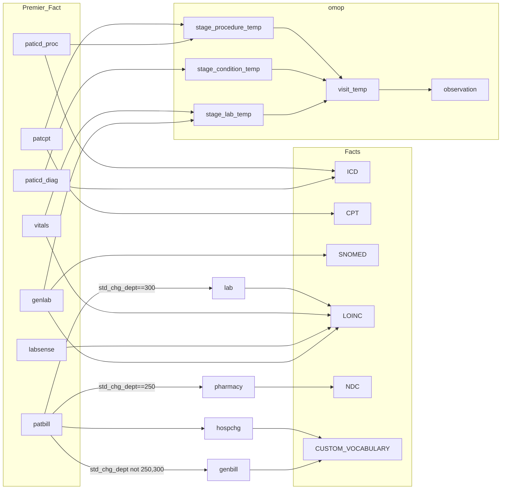
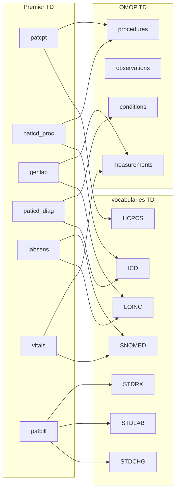
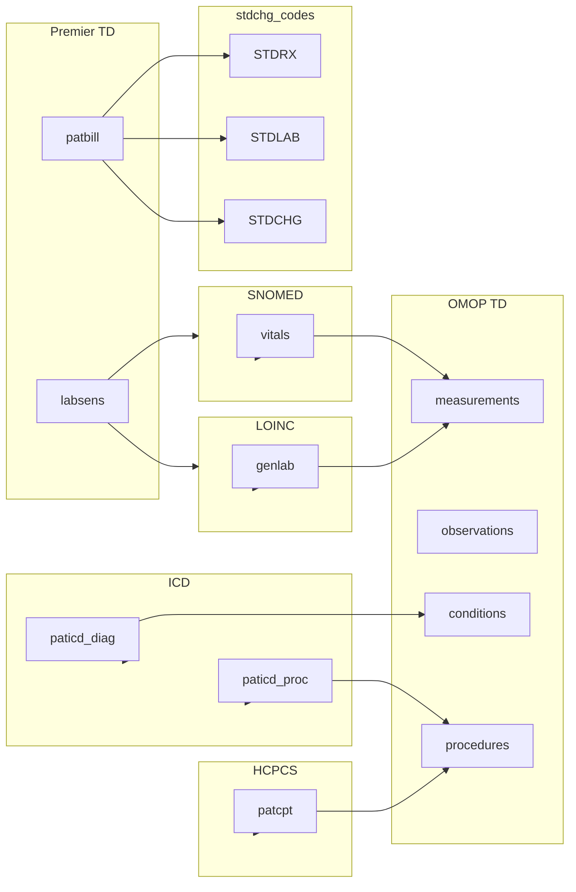

# Premier Times Series Feature Store

Using [Standardized Vocabularies](https://ohdsi.github.io/TheBookOfOhdsi/StandardizedVocabularies.html) and custom CDH vocabularies e.g. edav_prd_cdh.cdh_PREMIER.CHGMSTR

For all healthdata 

#### Data Challenges with Premier

* Premier Fact Tables do *NOT* contain 

#### Patient Fact Table  

**OMOP Mappings**  

Note: _source_type_value --> _type_concept_id  

patcpt:
  - 38000275 AS procedure_source_type_value,  

paticd_diag:  
  -    case d.icd_pri_sec 
  -    when 'A' then 42894222   
      when 'P' then 44786627  
      when 'S' then 44786629  
    end AS condition_source_type_value,  
#TODO Change FACTS vocabulary  
    case d.icd_version   
      when '10' then 'ICD10CM'  
      else 'ICD9CM'  
    end AS condition_code_source_type,  

paticd_proc:  
    case d.icd_pri_sec   
      when 'P' then 44786630  
      when 'S' then 44786631  

genlab:  
    '44818702' AS measurement_source_type_value,  

vitals:  
    '44818702' AS measurement_source_type_value,      

For Premier:
  - PATBILL+CHGMSTR with custom vocabulary_id's
  - ICDDIAG, ICDPROC  (ICD* vocabulary)
  - GENLAB, LAB_SENS (SNOMED vocabulary)
  - GENLAB, LAB_SENS  (LOINC vocabulary)
  - CPT (CPT* vocabulary)
  - Demographics (TBD)
  - Lab/Vitals results (TBD)

Feature Table:
  - code
  - vocabulary_id
  - FEATURE

Cohort Table/List **defined by Principal Investigator*
  - PATIENT_ID

FEATURE_STORE is inner join of Cohort, Feature, and Patient Fact tables.

#### OMOP to FACT

  