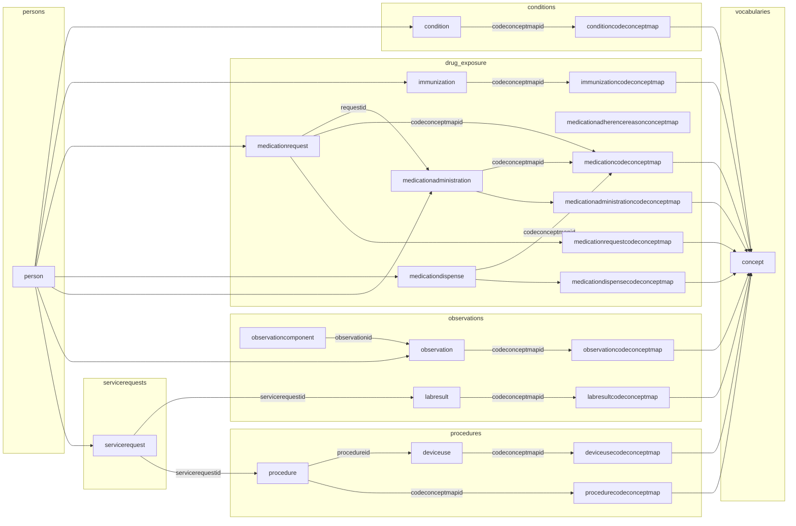

### Truveta Events Data Model  
#### Overview  
Truveta aggregates health system data from multiple sources, including clinical and administrative "events" following the [OHDSI OMOP Common Data Model](https://ohdsi.github.io/CommonDataModel/) (CDM) (at the OHDSI Domain level but not the data format), demographics and firmographics, with reference data.  


#### Tables  
Truveta "event" tables are grouped into five "domains": [conditions](https://learn.truveta.com/studio/docs/conditions) (diagnoses), measurements ([vitals], labs), [observations(https://learn.truveta.com/studio/docs/observations)], [drug exposure](https://learn.truveta.com/studio/docs/medications), (meds, immunizations), procedures and [device](https://learn.truveta.com/studio/docs/device-use) exposure, "Standardized Health System" tables, and "Standardized Vocabulary" tables.  

#### Dates  
Truveta "event" tables have multiple possible date columns depending on source. Truveta Studio methods to select the first non-null date by table. The **condition* table contains two date columns, 'OnsetDateTime' and 'RecordedDateTime', with guidance to use 'OnsetDateTime' unless blank, then use 'RecordedDateTime'. This is consistent with collecting *diagnoses* across operational systems, where one may have a clinical finding of 'OnsetDateTime' and another may infer the *diagnosis* from a lab result or other observation, in which case

Truveta data are [de-identified](https://learn.truveta.com/studio/docs/de-identification-and-suppression) using a date shifting algorithm from -30 to +30 days within a patient record which preserves the date intervals , but across patients a given event is within a 60 day sliding window.

#### Concept Codes
Truveta [event tables map to <event>codeconceptmap tables](https://learn.truveta.com/studio/docs/truveta-data-model#codeconceptmap-table-joins), and often a one-to-many relationship. Truveta Studio provides methods called **load_filtered_table()**  and **codeset()** which manage the complex relationship from an event table to the concept table. 

#### Vocabularies  
Truveta "Standardized Vocabulary" includes not only "concepts" in common clinical [vocabularies](https://learn.truveta.com/studio/docs/code-sets) (SNOMED, ICD%, LOINC, etc) but also "concepts" for other system uses and includes custom "TRUVETA" concepts. These concepts are in the Truveta **concept** table keyed by **conceptid**, and mapped to any *event* table through an intermediate table *event*codeconceptmap.


#### Duplicative Records in Event Tables
As is typical with mapping data from operational systems to the OHDSI domains, a single health system record can map to more than one domain, e.g. a positive lab result results in a diagnosis and may generate TWO **condition** events, one from the positive lab, the other from a providers actual **condition** diagnosis. This is by design, and in the Truveta Data Model accomodates these by differentining a **patientid** from the record of source from the **personid**, which links actual patients across "event" tables. 

Within the set of **condition** records for one **personid** and discounting the **encounterid** and **patientid** duplicate diagnosis records will appear for a given **patientid**/{date} combination if the diagnosis was from two different operational systems with differing concept codes e.g. a positive lab results in LOINC or SNOMED and a diagnosis in ICD% system.


The "events" data model, from [Truveta Data Dictionary](https://learn.truveta.com/studio/docs/data-dictionary) (look for Download Data Dictionary), is:



#### Dates by event table
```R
dates = list(
        Account= c('ServiceStartDateTime', 'RecordedDateTime'), # note: not in Prose
        CareSiteRequestHistory= 'EffectiveDateTime', # note: not in Prose
        Claim= 'ServiceBeginDate', # note: not in Prose
        ChargeItem = c('ServiceDateTime', 'RecordedDateTime'), # note: not in Prose
        Condition= c('OnsetDateTime', 'RecordedDateTime'),
        DeviceUse= c('ActionDateTime', 'RecordedDateTime'),
        Encounter= 'StartDateTime',
        EncounterHistory= c('StartDateTime', 'RecordedDateTime'), # note: not in Prose
        Enrollment = 'StartDate',
        EventLog = c('EffectiveDateTime', 'RecordedDateTime'), # note: not in Prose
        Extract= c('EffectiveDateTime', 'RecordedDateTime'), # note: not in Prose
        FamilyMemberHistory= 'RecordedDateTime',
        ImagingInstance= 'AcquisitionDateTime',
        ImagingSeries= 'SeriesDateTime',
        ImagingStudy= 'StudyDateTime',
        Immunization= c('AdministeredDateTime', 'RecordedDateTime'),
        LabResult= c('EffectiveDateTime', 'SpecimenCollectionDateTime', 'RecordedDateTime'),
        MedicalClaim = 'ServiceStartDate',
        MedicationAdministration= c('StartDateTime', 'RecordedDateTime'),
        MedicationDispense= 'DispenseDateTime',
        MedicationRequest= c('StartDateTime', 'AuthoredOnDateTime'),
        MedicationStatement= c('EffectiveDateTime', 'RecordedDateTime'),
        Note= 'EffectiveDateTime',
        Observation= c('EffectiveDateTime', 'RecordedDateTime'),
        PersonDeathFact= 'DeathDateTime',
        PersonLocation= 'EffectiveStartDateTime', # note: in Prose it is EffectiveDateTime
        Person= 'BirthDateTime',
        PharmacyClaim= 'ServiceDate',
        Procedure= c('StartDateTime', 'RecordedDateTime'),
        ServiceRequest= c('OccurrenceStartDateTime', 'AuthoredOnDateTime', 'RecordedDateTime')
    )
```