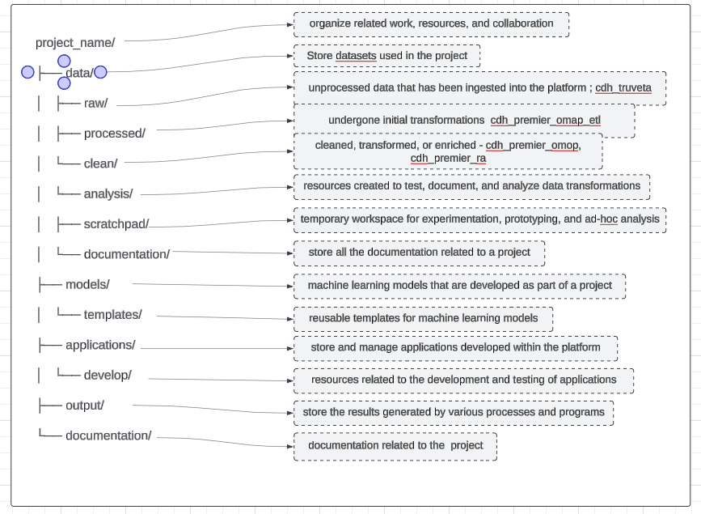
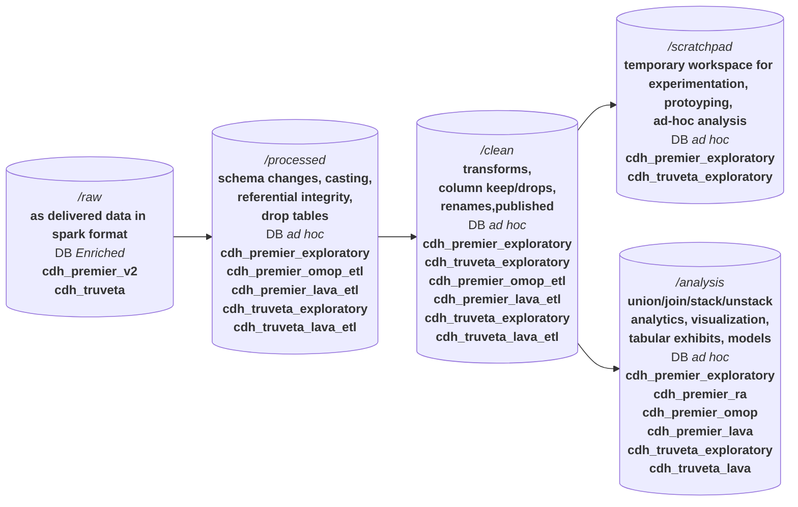

### Foundry Directories to current EDAV DB Schemas

* **/raw** - cdh_premier_v2 cdh_truveta
    * as delivered data in delta table format  
* **/processed** - cdh_premier_omop_etl, cdh_premier_lava_etl, cdh_truveta_lava_etl,cdh_premier_exploratory, cdh_truveta_exploratory
  *  schema changes, casting, augmentation
* **/clean** - cdh_premier_exploratory, cdh_truveta_exploratory
    * transformed, cleaned, published
* **/analysis** - cdh_premier_omop, cdh_premier_lava, cdh_truveta_lava,cdh_premier_exploratory, cdh_truveta_exploratory
    * format ready for analytics, including visualization, tabular exhibits, models
    * union/joins with references or other tables
* **/scratch_pad** - cdh_premier_exploratory, cdh_truveta_exploratory
    * temporary workspace for experimentation, protoyping, ad-hoc analysis

### Foundry Use?
* **/raw** - cdh_premier_v2 cdh_truveta
  * as delivered in delta format 
* **/processed** - [no DB equivalent]
  *  schema changes, casting, augmentation, QC/QA from Data Management
* **/clean** -   cdh_premier_omop_etl, cdh_premier_lava_etl, cdh_truveta_lava_etl, *_exploratory
  * transformed, cleaned, basis for analysis sets e.g. **Medallion Silver**, goal is standard *curated* and *published* offerings for **/analysis**, run by engineering, defined by Data Management/Data Support/Analysts
* **/analysis** - cdh_premier_omop, cdh_premier_lava, cdh_truveta_lava, *_exploratory
    *  format ready for analytics, including visualization, tabular exhibits, models
    * union/joins with references or other tables 
* **/scratchpad** - Temporary workspace for ad-hoc analysis, experimentation, proto-typing, and CI/CD to **/processed** or **/clean**

### [Pipelines recommended structure](https://www.palantir.com/docs/foundry/building-pipelines/recommended-project-structure)  
  

