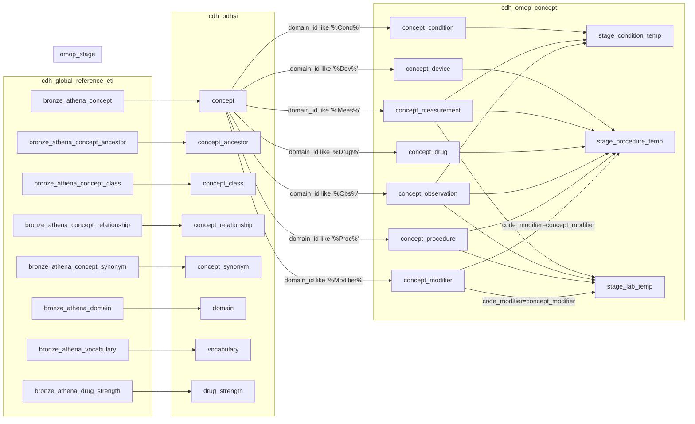

#### [etl/common/omop_table_ddl](https://www.github.com/cdcent/cdh-ohdsi/etl/common/omop_table_ddl)



####concept domains  
Measurement  
Observation 
Device 
Drug  
Condition  
Procedure  
Meas Value  
Condition/Meas  
Meas Value Operator  
Condition/Device
Type Concept
Specimen

#### intersection of GTRI concept domains with usual Datahub Vocabularie

```sql
select domain_id, vocabulary_id, count(concept_id) as concept_counts  
from IDENTIFIER(concat(:omop_catalog, '.', :omop_schema, '.concept')) src
  where src.domain_id like '%Dev%' or src.domain_id like '%Drug%' or src.domain_id like '%Cond%' or src.domain_id like '%Meas%' or src.domain_id like '%Obs%'  or src.domain_id like '%Proc%' 
  group by domain_id, vocabulary_id
  order by  vocabulary_id,domain_id
```
### CPT4 directions

CPT4 utility for CDM v5.  

This utility will import the CPT4 vocabulary into concept.csv.
Internet connection is required.  

Start import process from command line with:  
 windows: cpt.bat APIKEY  
 linux: ./cpt.sh APIKEY  

Use API KEY from UMLS account profile: https://uts.nlm.nih.gov//uts.html#profile  
Do not close or shutdown your PC until the end of import process,
it will cause damage to concept.csv file.  

Please make sure java allowed to make http requests and has write permission to the concept.csv file.  

Note (version 1.14 and higher): when working with a delta bundle, please get familiar with the instructions from the README.md file  


###Full Table 

CVX
DRG
HCPCS
ICD10
ICD10CM
ICD10CPS
ICD9CM
ICD9Proc
~~ICDO3~~
LOINC
NDC
OMOP Extension
SNOMED
PCORNet
RxNorm
UB04 Pri Typ of Adm
UB04 Typ bill
VA Class

|_domain_id_|_vocabulary_id__|_concept_counts_|keep|
|---------|-------|----------|--------------------|
|**Drug**|**CVX**|**271**||
|**Observation**|**DRG**|**1362**||
|Condition|HCPCS|1||
|Device|HCPCS|5220||
|Drug|HCPCS|1911||
|Measurement|HCPCS|184||
|Observation|HCPCS|3306||
|Procedure|HCPCS|1326||
|Condition|ICD10|14099||
|Measurement|ICD10|114||
|Observation|ICD10|2227||
|Procedure|ICD10|198||
|Condition|ICD10CM|88213||
|Condition/Device|ICD10CM|1||
|Condition/Meas|ICD10CM|8||
|Measurement|ICD10CM|166||
|Observation|ICD10CM|10654||
|Procedure|ICD10CM|88||
|~~Condition~~|~~ICD10CN~~|~~30555|~~|
|~~Measurement~~|~~ICD10CN~~|~~268~~|~~|
|~~Observation~~|~~ICD10CN~~|3182|~~|
|~~Procedure~~|~~ICD10CN~~|486|~~|
|~~Condition~~|~~ICD10GM~~|15941|~~|
|~~Measurement~~|~~ICD10GM~~|116|~~|
|~~Observation~~|~~ICD10GM~~|1125|~~|
|~~Procedure|~~ICD10GM~~|193|~~|
|Device|ICD10PCS|3||
|Drug|ICD10PCS|173||
|Procedure|ICD10PCS|196048||
|Condition|ICD9CM|15149||
|Measurement|ICD9CM|208||
|Observation|ICD9CM|1979||
|Procedure|ICD9CM|228||
|**Procedure**|**ICD9Proc**|**4657**||
|~~**Procedure**|**ICD9ProcCN**|**13385**|~~|
|Condition|ICDO3|62535||
|Observation|ICDO3|1536||
|Meas Value|LOINC|20153||
|Measurement|LOINC|146202||
|Observation|LOINC|89425||
|Procedure|LOINC|9701||
|Device|NDC|12009||
|Drug|NDC|1183702||
|Condition|OMOP Extension|349||
|Device|OMOP Extension|21||
|Meas Value|OMOP Extension|2||
|Measurement|OMOP Extension|819||
|Observation|OMOP Extension|230||
|Procedure|OMOP Extension|21||
|~~**Measurement**~~|~~**OMOP Genomic**~~|**289889**|~~|
|~~**Drug**~~|~~**OMOP Invest Drug**~~|**29727**|~~|
|**Observation**|**PCORNet**|**81**||
|**Drug**|**RxNorm**|**308709**||
|**Drug**|**RxNorm Extension**|**2145325**||
|Condition|SNOMED|154656||
|Device|SNOMED|217973||
|Drug|SNOMED|254167||
|Meas Value|SNOMED|5032||
|Meas Value Operator|SNOMED|7||
|Measurement|SNOMED|39066||
|Observation|SNOMED|272482||
|Procedure|SNOMED|83285||
|**Observation**|**UB04 Pri Typ of Adm**|**6**||
|**Observation**|**UB04 Typ bill**|**19**||
|**Drug**|**VA Class**|**576**||

