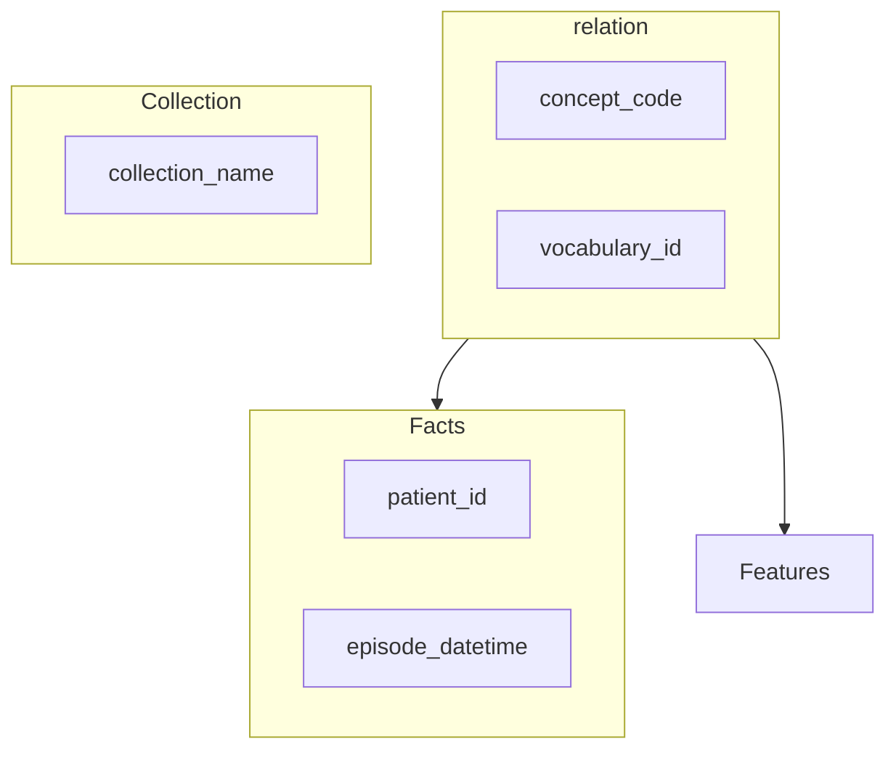
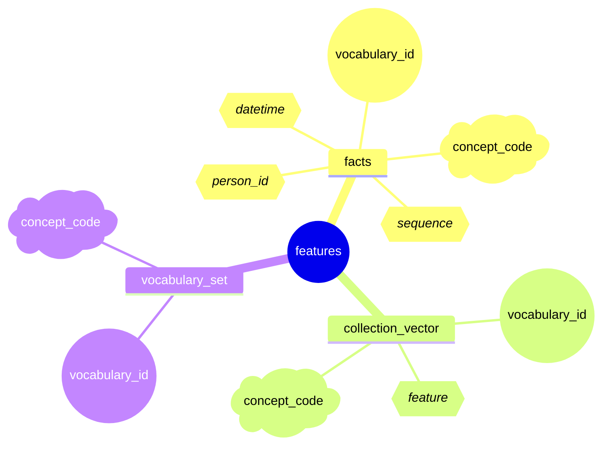

### Core Collection Tables

#### UMLS Value Sets
- [PHIN VADS](https://phinvads.cdc.gov/vads/SearchVocab.action)
- [UMLS MetaThesaurus API](https://www.nlm.nih.gov/research/umls/knowledge_sources/metathesaurus/index.html)

Core difference is update schedule
| Table | [MetaThesaursus](https://www.nlm.nih.gov/research/umls/knowledge_sources/metathesaurus/index.html)  | [PHIN VADS](https://phinvads.cdc.gov/vads/downloads/CodeSystem_UpdateCalendar.pdf) |
| --- | --- | --- |
| LOINC | bim | Jul,Dec |
| SNOMED | | Mar, Sep|
| RxNorm | | April |
| ICD-10 | | September|
| NNDSS | | December |
| HL7 | | June|

### Collection Data

#### Canonical Data Fact Tables

#### Vocabulary Code Reference Table

#### Vocabulary Code Feature Dimensions
