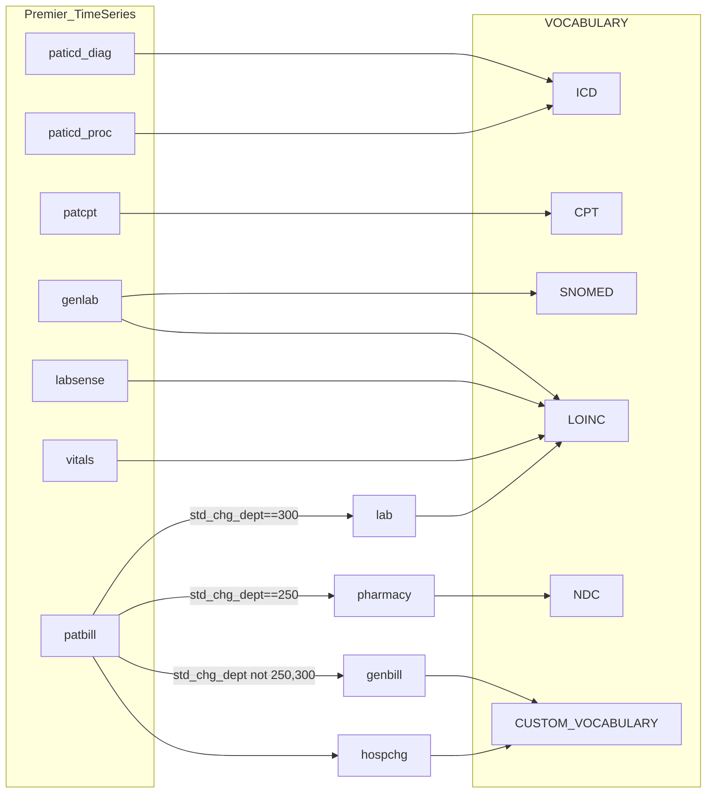

```mermaid
flowchart LR
subgraph VOCABULARY
    ICD
    CPT
    SNOMED
    LOINC
    NDC
    CUSTOM_VOCABULARY
end
subgraph Premier_TimeSeries
paticd_diag
paticd_proc
patcpt
genlab
labsense
vitals
patbill
end
paticd_diag-->ICD
paticd_proc-->ICD
patcpt-->CPT
genlab-->LOINC
labsense-->LOINC
vitals-->LOINC
genlab-->SNOMED
patbill-->|std_chg_dept==300|lab
patbill-->|std_chg_dept==250|pharmacy
pharmacy-->NDC
lab-->LOINC
patbill-->|std_chg_dept not 250,300|genbill
genbill-->CUSTOM_VOCABULARY
patbill-->hospchg
hospchg-->CUSTOM_VOCABULARY
```
