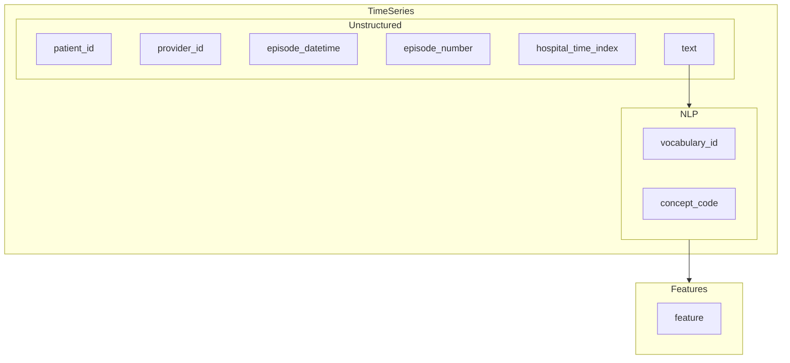

# Unstructured Data Transformation
##Unstructured to OMOP NOTE table for CDH ML ABFM *WITHOUT* creating new concepts 

 based on [OMOP CDM Note](https://ohdsi.github.io/CommonDataModel/cdm54.html#note)

* *note_id* - System Generated
* *person_id*
* *note_datetime*
* *note_type* (rather than concept_id, but should align)  algorithmically generated
* *note_class* (rather than concept_id, but should align) algorithmically generated
* *note_title* **section_name**
* *note_text* 
* *encoding* UTF etc
* *language*
* *provider_id* - practice_id
* *observation_period_id* (may be null)
* *note_sequence* sequence within person_id, note_datetime for duplicate notes, or may allow for sentencization

### Roadmap

#### On the fly featurization pipeline?

https://learn.microsoft.com/en-us/azure/architecture/solution-ideas/articles/large-scale-custom-natural-language-processing  

* Raw --> Split by Encoding Tag with encoding, document patterns by provider
* Enriched --> core schema
* Encoded --> define parsing patterns
* Parsing --> Parse individual Raw data into one or more "text documents" based on parsing patterns by title, including combining split sentences and/or splitting into sentences 
* Text [*edav_prd_cdh.cdh_abfm*] --> DocumentAssembler() [?]
* Document [Silver Layer] --> SentenceDetection() *SPARK NLP*
* Tokenization() *huggingface*, *spaCy*
