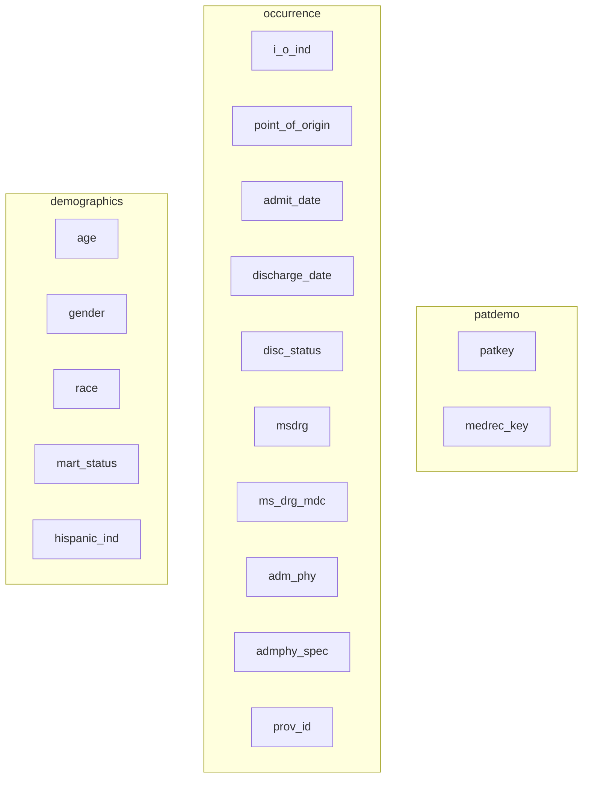
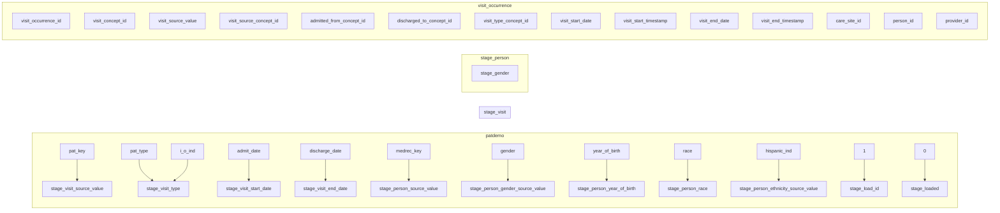
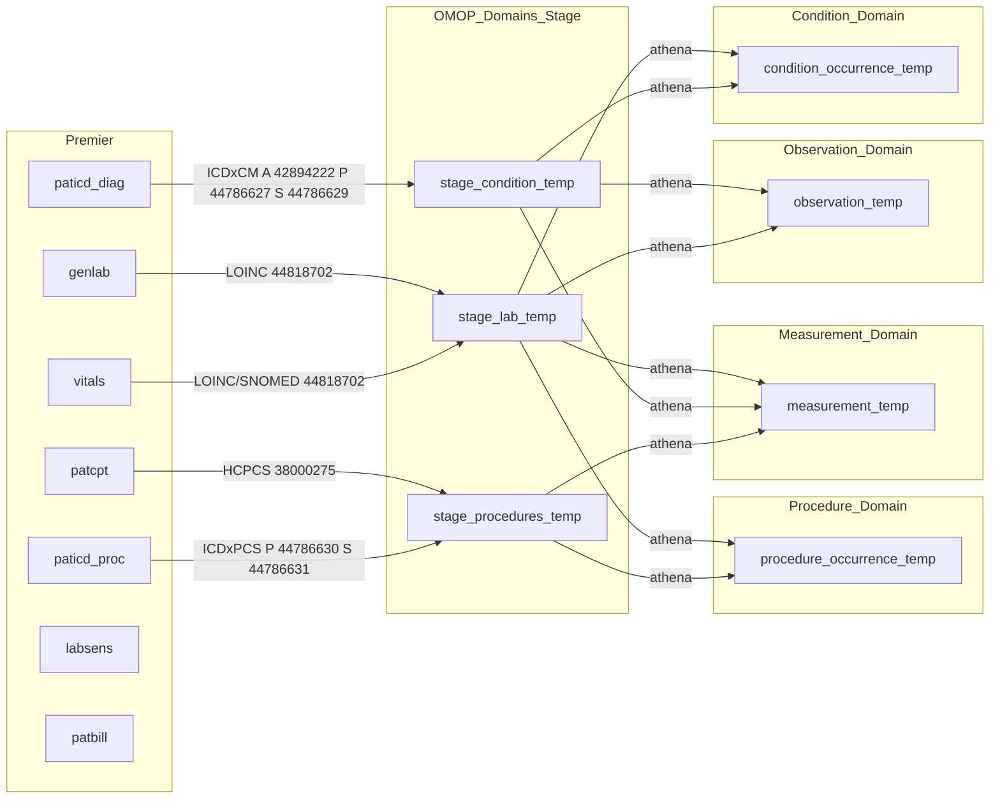
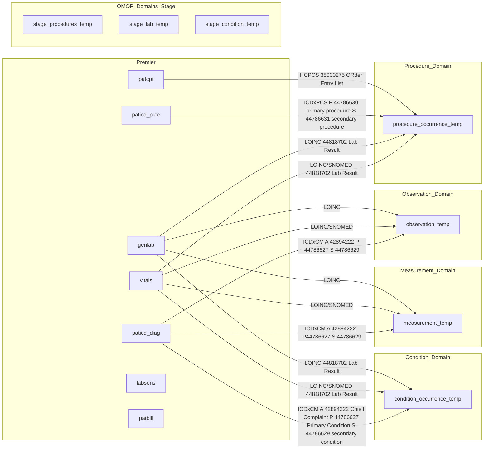

### Tables read from premier

* common\intermediate\5_write_{domain}.py
* [Athena links](https://athena.ohdsi.org/search-terms/terms/38000275)


   
```python
    case pat.gender
        when 'M' then 8507
        when 'F' then 8532
        when 'A' then 8570
        when 'U' then 8551
        when 'O' then 8521
        when null then null
        else 8551
    end as gender_concept_id,
```

```python
# visit_type
      when a2.pat_type = 28 then 'ER' when 'ER' then 9203
      when a2.i_o_ind = 'I' then 'IN' when 'IN' then 9201
      when a2.i_o_ind = 'O' then 'OUT' when 'OUT' then 9202
      else null  when 'LONGTERM' then 42898160
```
```python
# race
        when 'W' then 'White'
        when 'B' then 'Black'
        when 'A' then 'Asian'
        when 'O' then 'Other'
```

=======







* premier\todo\4b3_create_labs_meas
* premier\todo\4c3_create_procedures_meas

#### Current ODHSI

* Conditions
    - paticd_diag
* Labs
    - genlab
* Vitals
    - vitals
* Procedures
    - paticd_proc
* Visits
    - patdemo


#### Current CDH Featurization by Vocabulary

* CPT/HCPCS
    - patcpt
* ICD
    - paticd_diag
    - paticd_proc
* LOINC
    - genlab
    - **lab_sens**
    - vitals
* SNOMED
    - genlab
    - **labres**
* STDCODE
    - **pharmacy**
    - lab
    - allother
* HOSPCHG
    - **pharmacy**
    - lab
    - all other    

